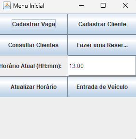
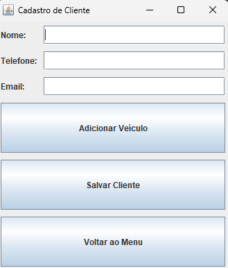
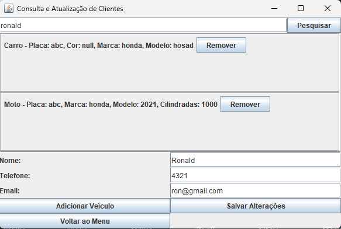
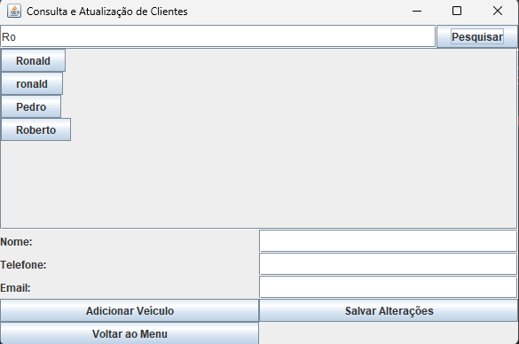
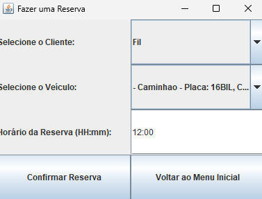
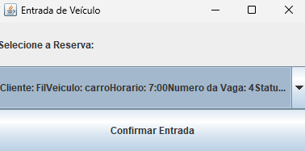

# 🚗 Gerenciador de Estacionamento

Um sistema desenvolvido como projeto acadêmico para demonstrar os conhecimentos adquiridos durante a disciplina de **Linguagem de Programação II**.

O sistema permite gerenciar clientes e vagas de estacionamento de forma prática, oferecendo funcionalidades de cadastro, atualização de dados, busca de clientes, realização de reservas e confirmação de chegada de veículos.

---

# 📸 Demonstração

## 🏠 Menu Inicial

Tela principal do sistema, responsável por centralizar o acesso a todas as funcionalidades disponíveis.

---

## 👤 Cadastro de Clientes

Permite registrar novos clientes no sistema, armazenando suas informações para futuras consultas e reservas.

---

## ✏️ Atualização de Dados

Funcionalidade responsável pela edição e atualização dos dados de clientes já cadastrados.

---

## 🔍 Busca de Clientes

Possibilita localizar clientes cadastrados por meio de consultas rápidas no banco de dados.

---

## 📅 Reserva de Vagas

Permite que clientes realizem reservas antecipadas de vagas no estacionamento.

---

## 🚘 Confirmação de Chegada

Funcionalidade utilizada para registrar a chegada do veículo reservado ao estacionamento.

---

# ✨ Funcionalidades

* Cadastro de clientes
* Atualização de dados cadastrais
* Consulta e busca de clientes
* Reserva de vagas
* Confirmação de chegada de veículos
* Interface baseada em menus
* Gerenciamento simplificado de operações do estacionamento

---

# 🛠 Tecnologias Utilizadas

* Java
* Programação Orientada a Objetos (POO)
* Estruturas de Dados
* Conceitos de Persistência de Dados
